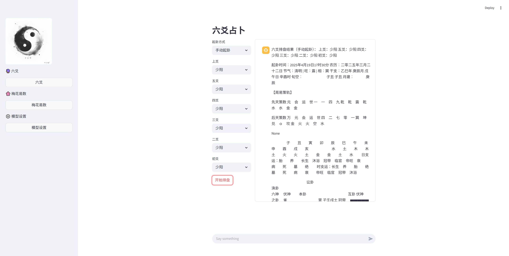

# CyberYi
<div align="center"> 

 </div>


## 项目简介
这是一个基于AI技术的易经占卜系统，整合了多种传统占卜方法(梅花易数、六爻等)和现代自然语言处理技术，提供智能化的占卜体验。


## 主要功能
- 支持占卜方式：六爻，基于 ichingshifa，由于原作者使用繁体中文，已替换为简体中文
- 经典文本RAG数据库：包含《京氏易传》、《卜筮正宗》等经典文本，暂时不支持加入新的txt文件
- AI解卦：结合传统解卦方法和现代NLP技术，目前支持deepseek。需要在模型设置页面设置key以及embeding模型，embeding目前支持硅基流动
- Web交互界面：基于Streamlit的友好界面

## 技术栈
- Python
- Streamlit (Web界面)
- LangChain (AI处理框架)
- ChromaDB (向量数据库)
- DeepSeek (大模型接口)

## 安装指南
1. 克隆本仓库
```bash
git clone https://github.com/motobiubiu/CyberYi
cd cyberYi
```

2. 安装依赖
```bash
pip install -r requirements.txt
```


## 使用方法
1. 启动Web界面
```bash
streamlit run app.py
```

2. 在浏览器中访问 `http://localhost:8501`

## 待开发功能
1.梅花易数排盘工具 

2.rag优化，以及增加文本功能

3.更多大模型api支持

4.流式输出
...


## 参考项目
ichingshifa：https://github.com/kentang2017/ichingshifa
